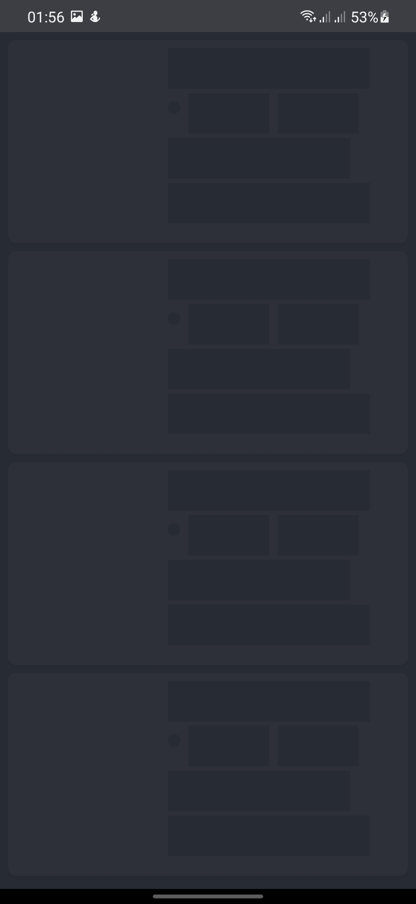
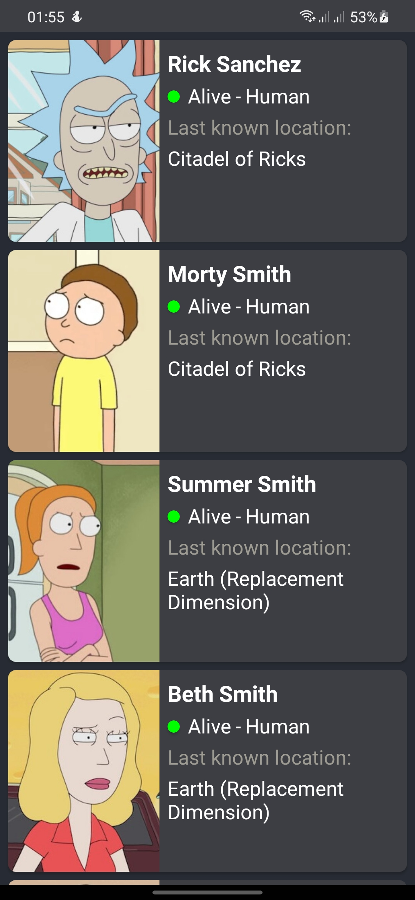
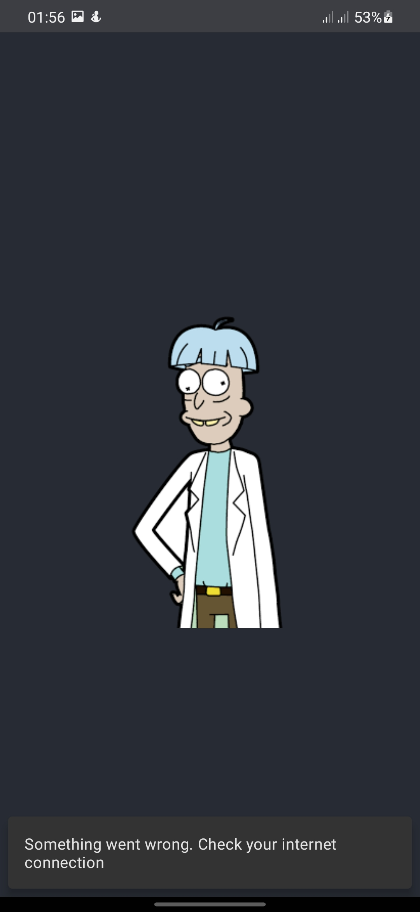

## ⚠️: This project is currently being migrated to jetpack compose🏗️

## Rick and Morty App

An android app built with MVVM architecture that consumes [Rick and Morty characters](https://rickandmortyapi.com/api/character) rest api

Min Api Level: 21 [Android 5.0](https://developer.android.com/studio/releases/platforms)

Build System : [Kotlin KTS](https://developer.android.com/studio/build/migrate-to-kts)

>**Note**: This project has two branches:
> - [compose-main](https://github.com/KimAdrian/RickandMorty/tree/compose-main) - uses jetpack compose
> - [xml-main](https://github.com/KimAdrian/RickandMorty/tree/xml-main) - uses xml

## Screenshots

|  |  |  |  |
|--------------------------------------|-----------------------------------------|------------------------------|-------------------------------|

## Setup Guide

- Clone the repo and Build

## Libraries

- [Retrofit2](https://square.github.io/retrofit/) : A type-safe HTTP client for Android and Java.
- [Timber](https://github.com/JakeWharton/timber) : A logger with a small, extensible API which provides utility on top of Android's normal Log class.
- [Moshi](https://github.com/square/moshi) : A modern JSON library for Android, Java and Kotlin. It makes it easy to parse JSON into Java and Kotlin classes.
- [Glide](https://github.com/bumptech/glide) : A fast and efficient open source media management and image loading framework.
- [Paging 3](https://developer.android.com/topic/libraries/architecture/paging/v3-overview) : The Paging library helps you load and display pages of data from a larger dataset from local storage or over network.
- [Shimmer](https://github.com/facebook/shimmer-android) : an Android library that provides an easy way to add a shimmer effect to any view in your Android app.
